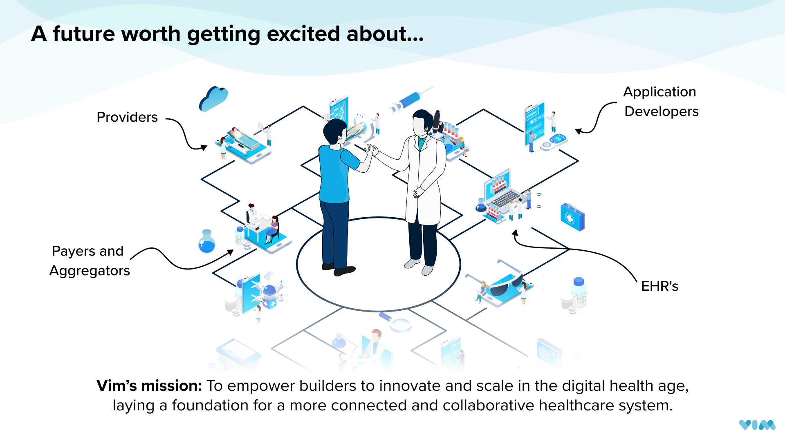

# The Vim Canvas™️ Developer Platform {#The-Vim-Canvas-Developer-Platform}
Vim is the middleware platform for healthcare. Vim Canvas:tm: is a self-service platform that empowers application developers to embed their application into Electronic Health Record (EHR) workflows, resulting in a streamlined and low-friction experience for end users. With Vim, you can deploy your applications on top of Vim Connect - Vim's in-EHR connectivity layer - accelerating time to market at reduced cost and improved flexibility. You can leverage Vim's platform to engage with a growing network of 2,000+ provider organizations and 8M+ patients.

 

### Vim’s key capabilities
* The Vim OS platform enables communication with EHRs by **identifying, reading, and sharing context**, data, and entities from the EHR such as a patient in context, an open encounter, and an order/referral being opened. 
* Certain **data elements can also be written/updated back to the EHR**, such as adding diagnosis or procedure codes to an encounter, updating a target referral, and more. 
* Learn more about this functionality in the [Vim Connectivity](https://docs.getvim.com/vim-os-js/vim-ehr-connectivity.html) and [Vim Connectivity write-back](https://docs.getvim.com/vim-os-js/vim-ehr-connectivity.html#writeback-to-ehr-resources) guides.

