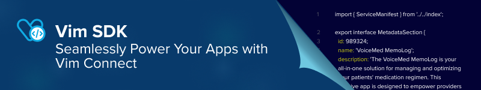
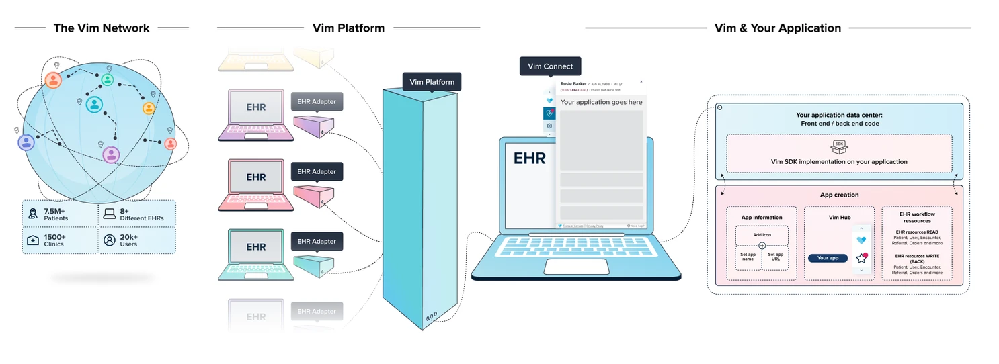

   
  <a href="https://getvim.com" target="_blank">Vim</a>
    &nbsp;&nbsp;-&nbsp;&nbsp;
  <a href="https://docs.getvim.com" target="_blank">Docs</a>
    &nbsp;&nbsp;-&nbsp;&nbsp;
  <a href="https://github.com/getvim" target="_blank">Code samples</a>
    &nbsp;&nbsp;-&nbsp;&nbsp;
  <a href="https://getvim.com/vim-canvas-developer-platform-on-demand" target="_blank">Video</a>
    &nbsp;&nbsp;-&nbsp;&nbsp;
  <a href="https://getvim.com/vim-canvas-developer-platform" target="_blank">Register</a>
   &nbsp;&nbsp;-&nbsp;&nbsp;
  <a href="https://getvim.com/blog" target="_blank">Blog</a>
   &nbsp;&nbsp;-&nbsp;&nbsp;
  <a href="https://docs.getvim.com/change-log" target="_blank">Dev updates</a>
   
  

# 👋 Hello Vim Developers!

## The Vim Canvas™️ Developer Platform

Vim is the middleware platform for healthcare. Vim Canvas™️ is a self-service platform that empowers application developers to embed their application into Electronic Health Record (EHR) workflows, resulting in a streamlined and low-friction experience for end users. With Vim, you can deploy your applications on top of Vim Connect - Vim's in-EHR connectivity layer - accelerating time to market at reduced cost and improved flexibility. You can leverage Vim's platform to engage with a growing network of 2,000+ provider organizations and 8M+ patients.

### Vim’s key capabilities

- The Vim OS platform enables communication with EHRs by **identifying, reading, and sharing context**, data, and entities from the EHR such as a patient in context, an open encounter, and an order/referral being opened.
- Certain **data elements can also be written/updated back to the EHR**, such as adding diagnosis or procedure codes to an encounter, updating a target referral, and more.
- Learn more about this functionality in the [Vim Connectivity](https://docs.getvim.com/vim-os-js/vim-ehr-connectivity.html) and [Vim Connectivity write-back](https://docs.getvim.com/vim-os-js/vim-ehr-connectivity.html#writeback-to-ehr-resources) guides.

# 🖥️ Sample Apps

- Documentation can be found in the [Vim Documentation Portal](https://docs.getvim.com/)

- Sample applications can be found here, in the [Vim Examples GitHub](https://github.com/getvim) organization.

# Repo Overview 😎

This repo contains example projects for building applications on top of Vim Canvas™️.
The applications in different frameworks demonstrate how to use the VimOS.js Canvas™️ SDK to interact with the Vim Canvas™️ platform.
The apps showcases the following features:

- Authentication with Vim Canvas™️
- Embedding an application into the Vim Canvas™️ platform
- Viewing EHR entities, including
  - Patients
  - Encounters
  - Referrals
  - Orders
- Updating EHR entities, including
  - Encounters
  - Referrals

# Structure

- [App Basic Template]() - With Authentication
- [Canvas Demo App](https://github.com/getvim/vim-canvas-demo-app) - Detailed Read/Write example
- [AI Scribe]() - A Sample Encounter Transcribing with Encounter Write example

# Contributing

- How can I submit an improvement?

  - Improvements are always welcomed! 🥳 Open a PR with a proper description and we'll review it as soon as possible

- Spot a bug 🕷 ?
  - We welcome code changes that improve the apps or fix a problem. Please make sure to follow all best practices and open an "Issue" and we'll review it as soon as possible.
